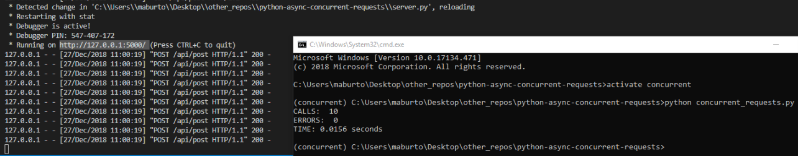

# python-async-concurrent-requests
A simple python script that allows for concurrent post requests by using async and await functionality with the help of the asyncio and aiohttp modules. I am using python version 3.7 and both the [asyncio](https://docs.python.org/3/library/asyncio.html) and [aiohttp](https://aiohttp.readthedocs.io/en/stable/). 

Asyncio is native to python after version 3.5 so there is no need to do a pip install if you are running python at that version or higher but aiohttp does have to be pip installed in the `concurrent_requests.py` file. This file is the actual file doing the post requests and the number of concurrent requests being called on line 122 in the `run()` function can be adjusted. The file `server.py` is a simple flask server (flask has to be installed) with one post route that accepts headers and a payload. Fire up the server by opening one command line window (terminal, cmd, etc) and running `python server.py` and then open up another command line window and run `python concurrent_requests.py` to fire off the concurrent calls. Below is an example of this concurrent behavior. 

Test the limits of your own servers by increasing the number of calls!
I used this [article](https://pawelmhm.github.io/asyncio/python/aiohttp/2016/04/22/asyncio-aiohttp.html) as a reference. 